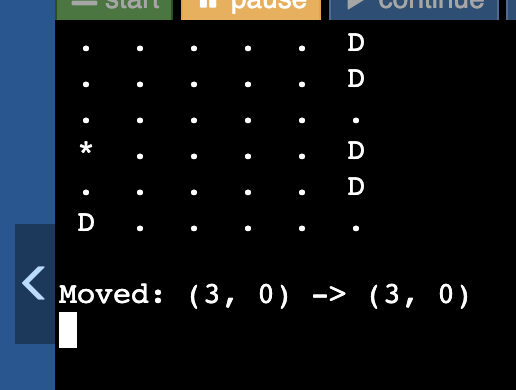
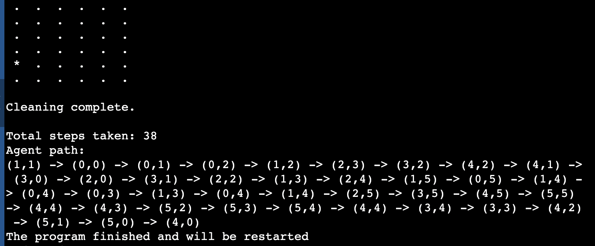
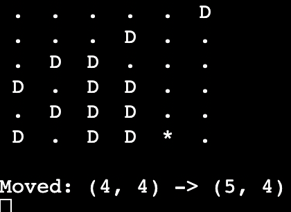
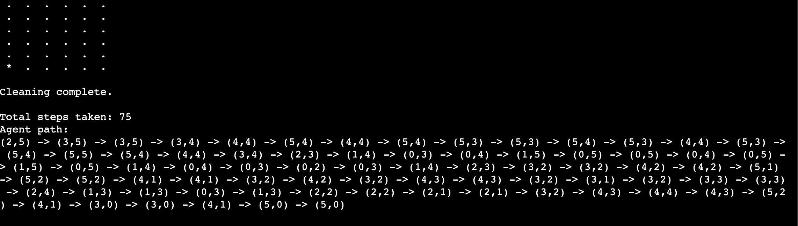
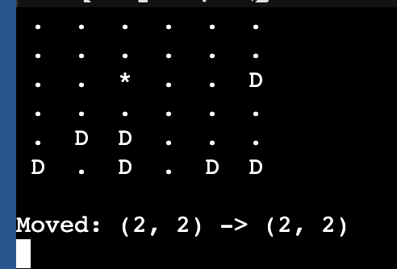
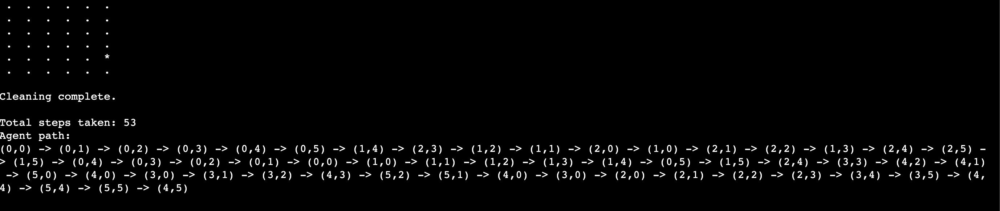

# Vacuum Cleaning Agents Labwork
**Student Name:** Anukul Pokharel  
**CRN:** 021-310  
**Date:** 2025-06-15

---

## Project Overview

This repository contains implementations of three types of vacuum cleaner agents in Python, designed to operate within a virtual room environment with randomly generated dirt:

- **Goal-Based Agent:** Uses memory and goal-testing to clean the environment efficiently.  
- **Simple Reflex Agent:** Acts based solely on the current state of the environment without memory.  
- **Utility-Based Agent:** Selects actions based on a utility function to balance cleaning and exploration.
  
Each agent navigates a 2D grid room, detects dirt, and cleans it by moving intelligently around the space.

---
## Goal-Based Agent

The Goal-Based Agent maintains memory of visited locations and uses a goal test to determine if cleaning is complete. It prioritizes moving towards dirty cells and keeps track of its path.

**Images:**  
- Initial Room State: 

- Final Output:
---
## Simple Reflex Agent

The Simple Reflex Agent acts only on the current cell's condition without memory. It cleans if the current spot is dirty and moves randomly otherwise, responding purely to immediate perceptions.

**Images:**  
- Initial Room State:
- Final Output: 
---

## Utility-Based Agent

The Utility-Based Agent evaluates possible moves based on a utility function balancing dirt cleaning and exploration, aiming to maximize overall performance over time.

**Images:**  
- Initial Room State:
- Final Output:
---
